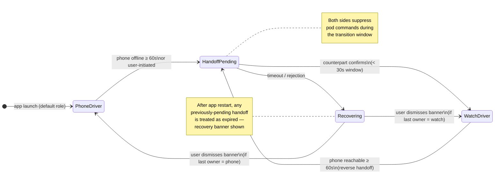

# Watch dynamics

This page explains the genuinely novel behavior of MyLoop With Watch:
how the iPhone and the Apple Watch divide responsibility for talking to
the pod and running the Loop algorithm. None of this exists in vanilla
Loop.

## The big idea: one driver at a time

At any given moment, exactly one device is the **driver** — the device
that has an active Bluetooth connection to your pod and runs the Loop
algorithm. The other device is the **passenger** — it shows status but
doesn't talk to the pod and doesn't compute doses.

The two states:

- **Phone-driving** (the default): your iPhone is in range of the pod
  (typically within ~10 meters / 30 feet). iPhone runs Loop every five
  minutes. The watch shows the latest glucose + IOB but defers to the
  phone.
- **Watch-driving**: your iPhone is out of range or off, and the watch
  has taken over. Watch runs Loop every five minutes. Watch alerts fire
  on your wrist.

### How to tell which device is driving

Look at the loop status ring on either device:

- **A filled dot in the center of the ring** (same color as the ring
  itself) = "this device is currently driving."
- **No dot in the center** = "the other device is driving" (this device
  is the passenger).

The dot **pulses gently** for the brief sub-second window during which
ownership is being handed off between phone and watch.

Same convention on both devices, so you always read the indicator
locally: "is my phone driving?" check the iPhone's loop ring; "is my
watch driving?" check the Apple Watch's loop ring. If both rings show a
dot at the same time during normal operation, that's a split-brain
condition the system detects and resolves automatically (phone wins).

<div style="display: grid; grid-template-columns: 1fr 1fr; gap: 1rem; max-width: 600px; margin: 1.5rem 0;">

<figure style="margin: 0; text-align: center;">

<figcaption><strong>iPhone</strong> — phone driving (dot)</figcaption>
</figure>

<figure style="margin: 0; text-align: center;">

<figcaption><strong>iPhone</strong> — watch driving (no dot)</figcaption>
</figure>

<figure style="margin: 0; text-align: center;">

<figcaption><strong>Apple Watch</strong> — watch driving (dot)</figcaption>
</figure>

<figure style="margin: 0; text-align: center;">

<figcaption><strong>Apple Watch</strong> — phone driving (no dot)</figcaption>
</figure>

</div>

_Mockups above show only the ring and indicator; the live HUD includes glucose, IOB, and other status around it. Real on-device screenshots will replace these after hardware verification._

## Handoff: how the watch takes over

Handoff is the moment when the driver role moves from one device to the
other. Two paths trigger it:

1. **Automatic, on phone disconnect.** When the phone has been
   out of Bluetooth range of the pod for several minutes, the watch
   notices, requests the BLE bond, and takes over. This is the typical
   bedtime case.
2. **Manual, in the watch app.** You can initiate a handoff from the
   watch's settings. Useful for testing, or for cases where you want
   the watch to take over before walking out of range.

When handoff happens, the BLE connection physically moves from the phone
to the watch. The bonding-handoff orchestrator in MyLoop ensures only
one device owns the bond at a time, so the pod never sees conflicting
commands.

### Lifecycle overview

This is the state machine each device runs. Both phone and watch run
the same code (the handoff stack is consolidated in a shared module
parameterized by role); the diagram applies to either.



Three safety properties baked into the lifecycle:

- **Pod commands are suppressed during the transition window.** Bolus,
  cancel-bolus, suspend, and resume all return a "try again" error if
  invoked while a handoff is pending. The previously-driving device
  resumes normal command authority after the transition completes or
  recovers.
- **Crashes mid-handoff always recover safely.** If the app restarts
  during the sub-second transition window, the persisted state is
  treated as expired and the user sees a recovery banner instead of an
  ambiguous mid-flight handoff. Worst case is "user dismisses banner";
  the system never resumes a half-finished transition.
- **Settings stay fresh on the watch.** Edits you make on the iPhone
  (target range, ISF, max bolus, etc.) propagate to the watch within
  one Loop iteration — about 30 seconds — without forcing a handoff.

## Warming up: the first few iterations after handoff

When the watch becomes the driver, it needs recent glucose, dose, and
carb history to compute a Loop iteration. Two paths:

- **Skip-warmup (the fast path).** If the watch has a fresh
  algorithm-state snapshot from the phone (one is pushed at the end of
  every phone iteration, ≤ 7 minutes old), the watch hydrates its
  stores from the snapshot and runs a full Loop iteration immediately.
  No warmup badge appears.
- **Full warmup (the safe fallback).** If no fresh snapshot is
  available — for example, the watch app cold-launched while the
  phone is offline — the watch displays a **"Loop warming up"** badge
  for the first few iterations (about 30 minutes) while it backfills
  recent glucose from the CGM and recent dose events from the pod.

While the warmup badge is showing:

- The algorithm is running, but on conservative defaults.
- Closed-loop dosing decisions are smaller / more cautious than they
  would be with full history.
- Glucose alerts fire normally.

After the warm-up window completes (or the snapshot fast-path succeeds),
the badge clears and the watch operates with full algorithm context.

A **runtime equivalence test** (`LoopAlgorithmReconciliationTests`)
verifies that the watch's Loop computation produces byte-identical
output to the iPhone's for the same input — across steady-state,
post-meal-carb, and predicted-hypo scenarios. This catches any future
drift between the two consumers of the shared algorithm code.

## What happens when phone + watch are separated

The intended scenario: you go to bed with your phone on the bedside
table, then leave the room. Your watch stays on your wrist. As you walk
away, the phone loses its BLE connection to the pod; the watch detects
this and initiates handoff. Within a few minutes, the watch is the
driver and Loop continues uninterrupted.

While you're separated:
- Glucose continues to update on the watch.
- Dosing decisions continue, computed on the watch.
- Alerts fire on your wrist.
- The phone may show "watch is currently driving" if you check it.
- If the watch has LTE or Wi-Fi, uploads to Nightscout continue
  directly from the watch. Caretakers see live data even with the
  phone fully offline. (Wi-Fi-only watches lose this until the phone
  reconnects.)

### Cold-launch while phone is offline

If you reboot or relaunch the watch app while your phone is unreachable,
the watch can still bootstrap the Loop driver. The most recent settings
sync from the phone is persisted to a shared App Group container on the
watch, so the watch reconstructs its therapy parameters (ISF, CR,
target range, max basal/bolus, suspend threshold) from disk without
needing a fresh handshake. If you've been using the system for a while
and the watch has ever been synced, this works even when the phone is
across the house, dead, or in the next room.

The only case where bootstrap fails is "the watch has never received a
single settings sync" — e.g., a fresh install with the phone offline.
In that case the watch waits with the warmup badge until a sync arrives.

## Reverting to phone-driving

When you return and the phone is reachable from the watch over Apple's
WCSession transport for **at least 60 seconds**, the reverse handoff
fires automatically: the phone takes the BLE bond back, and the watch
reverts to passenger. The 60-second debounce avoids flapping during
brief reconnect storms.

Same warming-up window applies in reverse — the phone's first
iteration after taking back the role uses its existing history, so
warming up is usually not visible.

The auto-revert behavior is governed by the handoff mode setting
(default: `automatic`). If you set the mode to `manual`, the watch
keeps the driver role until you initiate a handoff back to the phone
explicitly via the watch's settings.

## Remote care: driver owns the network

If you're a parent (or partner, or school nurse) and the Looper is
across the house — or across town — caretaker visibility and remote
commands work the same way regardless of whether the iPhone or the
Apple Watch is the BLE driver. **Whichever device is driving is also
the one that uploads to Nightscout and processes remote commands.**
The other device stays silent on the network the same way it stays
silent on Bluetooth.

In plain terms: a phone sitting at home with no signal does not cut
caretakers off, as long as the watch is the driver and the watch has
LTE or Wi-Fi. The watch uploads directly. Caretakers see continuous
status; remote-bolus / remote-carb / remote-override commands land at
the watch and are executed on the next loop cycle.

### Hardware requirement

This symmetry depends on the watch having its own internet path —
**an LTE Apple Watch (cellular plan) is required** for full
remote-care during watch-driving. A Wi-Fi-only Apple Watch that loses
its phone tether continues to drive the pod locally, but caretakers
will not see uploads or be able to send commands until the phone
reconnects. The dynamics page tells you which device is driving; if
you have a Wi-Fi-only watch, treat watch-driving + phone-offline as a
"caretaker-blind" condition.

### How driver-routing works under the hood

Each device publishes its APNs push token. Every Loop iteration, the
**driver** writes a small object to Nightscout's `devicestatus`
recording both tokens, who is currently driving, and an HMAC
signature against your Nightscout API secret:

```
loop.testingDetails.driverToken = {
  phone:  { token, expiresAt, lastSeen }
  watch:  { token, expiresAt, lastSeen }
  currentDriver: "phone" | "watch"
  signature: <HMAC-SHA256>
}
```

Caretaker apps and Nightscout's `loop` plugin read this field, verify
the signature, and target the *current driver's* token when sending
remote commands. During a handoff, the outgoing driver writes the
new `currentDriver` value to Nightscout *before* the BLE bond moves,
so caretaker polls always learn the new driver before they need to
send anything to it.

If the pre-handoff publication fails (transient network), the role
still flips and the new driver re-stamps `currentDriver` on its first
upload — caretaker visibility self-corrects within ~5 minutes. Pump
commands stay short-circuited during the transition window so nothing
double-executes.

### Caretaker app status

The driver-token field is brand-new (Build 888, 2026-05-04). For the
upstream caretaker apps to actually *use* the field, they need a small
upgrade. Status as of Build 888:

| Pathway | Today's behavior | After upstream PR lands |
|---|---|---|
| **Nightscout Care Portal** ([LoopDocs](https://loopkit.github.io/loopdocs/nightscout/remote-commands/)) | Targets the QR-captured phone token. Phone-driving works; watch-driving is invisible. | Server-side change to Nightscout's `loop` plugin to read `driverToken` and target `currentDriver`. **One PR; benefits all Care Portal users + Loop Caregiver indirectly.** Open as backlog item F.1a. |
| **Loop Caregiver** ([LoopKit/LoopCaregiver](https://github.com/LoopKit/LoopCaregiver)) | Routes commands via Nightscout, so it inherits whatever Nightscout's `loop` plugin does. | Automatically benefits from F.1a — no app-side change needed. |
| **LoopFollow** ([loopandlearn/LoopFollow](https://github.com/loopandlearn/LoopFollow)) v4.0+ | Direct-APNs path bypasses Nightscout; targets the QR-captured phone token. | Independent app-side PR (F.2) teaching the direct-APNs path to read `driverToken` and target `currentDriver`. |
| **Nightguard / NightWatch** ([nightscout/nightguard](https://github.com/nightscout/nightguard)) | Display-only on a cellular Apple Watch. No commands. | Unchanged — display-only follower, no driver-routing concern. |

Until F.1a and F.2 land upstream, MyLoop on Build 888 ships the
**publishing** half of symmetric remote care: caretakers can *see*
which device is driving, watch-driving uploads now reach Nightscout
directly, and the handoff handshake correctly stamps `currentDriver`
in the right order. The **command-routing** half waits on the
upstream caretaker-app PRs.

### Backward compatibility

Caretaker apps that don't know about `driverToken` continue to use
the QR-captured phone token. This means **phone-driving caretaker
integration is unchanged from Build 883** — no regression. Only
watch-driving + remote commands needs the upstream PRs.

## What to do if handoff doesn't happen

If you check the watch and the badge says it's still in passenger
mode after the phone has clearly gone out of range:

1. Wake the watch and open the MyLoop app.
2. Wait 30–60 seconds for the watch to detect the disconnect.
3. If still no handoff, manually initiate handoff via the watch's
   settings (see [Troubleshooting](/troubleshooting) for the gesture
   path).
4. If manual handoff also fails, fall back to manual insulin delivery
   and contact Carl.

## What is NOT yet supported

- Algorithm-level differences between phone and watch (the watch runs
  the same Loop algorithm with the same settings; nothing diverges).
- Multiple pods at once (one pod, one driver at a time).
- Handoff to a non-paired second iPhone (only paired Apple Watch).
- Critical Alerts on the watch when in Focus modes — this entitlement
  is pending Apple approval; for now use Focus exemptions or rely on
  the watch's haptic alerts.
- Watch-driving caretaker remote commands targeting the watch's APNs
  token. The publication side ships in Build 888 (`driverToken` field
  in Nightscout `devicestatus`), but the upstream caretaker apps
  (Nightscout `loop` plugin, LoopFollow direct-APNs) need PRs to read
  the field. Until those land, watch-driving + remote commands works
  only if the phone has network and can forward APNs to the watch via
  WCSession.
- Wi-Fi-only Apple Watch direct-uploads when the phone is unreachable.
  An LTE Apple Watch is required for the watch to upload to Nightscout
  while the phone is offline.

_Last updated: 2026-05-04 — Build 888 (covers B.8.1 through B.11)._

_Watch behavior verified on hardware: pending consolidated HV-1
session. The handoff lifecycle described above applies to Build 888
(uploaded 2026-05-04). Build 888 adds the **B.11 symmetric remote
care** umbrella on top of Build 883: watch APNs entitlements + token
publication (B.11.0); role-parameterized `RemoteCareUploader` with
driver-only-writes invariant (B.11.1); HMAC-signed `driverToken`
rendezvous in Nightscout `devicestatus` with token rotation
propagation (B.11.2 + B.11.2.1); pending-driver handshake that
publishes `currentDriver: <incoming>` before the BLE bond moves so
caretaker polls always see the new driver before sending commands
(B.11.3, fire-and-forget with idempotency-on-first-iteration safety
net)._

_Build 883 baseline (carried forward): live `LoopSettings` observer
+ dedup; persisted last-good settings; snapshot-driven skip-warmup
(real algorithm-state hydration via per-iteration buffers);
file-pointer fallback for oversized snapshot payloads;
`commandsAllowedCheck` gate on resume/suspend/cancel-bolus during
handoff transitions; always-recover after restart; iOS↔watch
algorithm reconciliation test (3 fixtures, byte-identical assertion);
consolidated handoff stack (single shared module, both phone and watch
run the same code parameterized by role)._

_Earlier shipped behavior: B.7 driver indicator (Build 872), B.8 watch
warmup elimination via algorithm-state snapshots (Build 872). Auto-revert
from watch back to phone shipped in Build 860._

_Pending upstream caretaker-app work: F.1a (Nightscout `loop` plugin
PR — server-side `driverToken` routing, benefits Loop Caregiver
indirectly) and F.2 (LoopFollow direct-APNs PR — independent of F.1a)._
