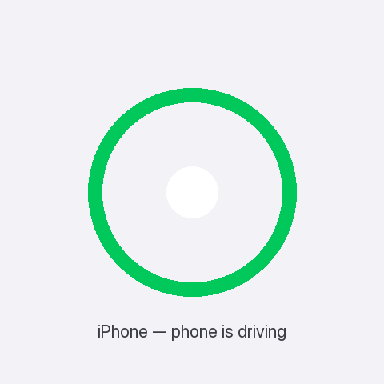
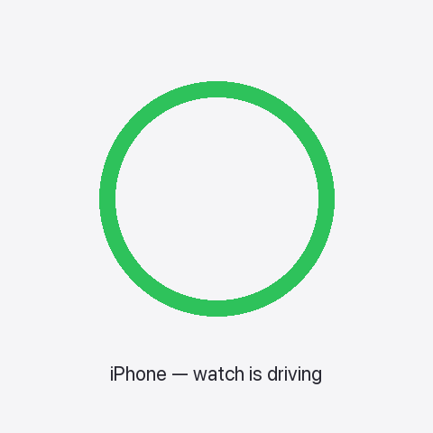
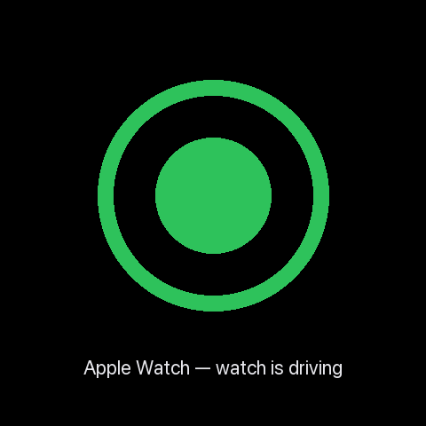
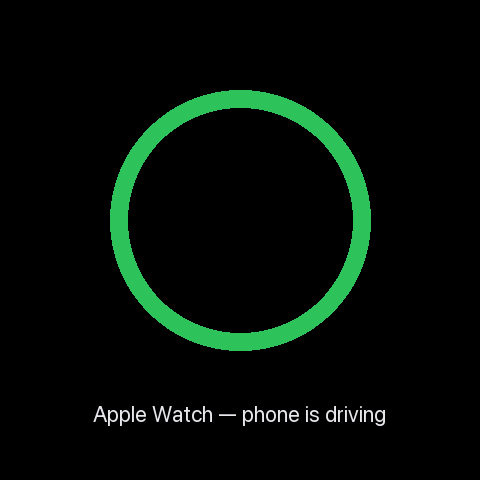
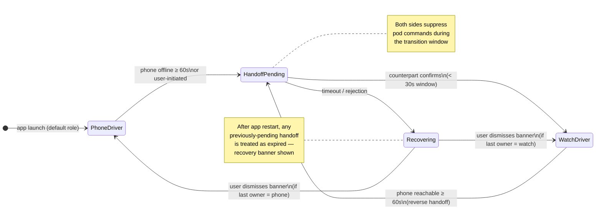

# Watch dynamics

This page explains the genuinely novel behavior of MyLoop With Watch:
how the iPhone and the Apple Watch divide responsibility for talking to
the pod and running the Loop algorithm. None of this exists in vanilla
Loop.

## The big idea: one driver at a time

At any given moment, exactly one device is the **driver** — the device
that has an active Bluetooth connection to your pod and runs the Loop
algorithm. The other device is the **passenger** — it shows status but
doesn't talk to the pod and doesn't compute doses.

The two states:

- **Phone-driving** (the default): your iPhone is in range of the pod
  (typically within ~10 meters / 30 feet). iPhone runs Loop every five
  minutes. The watch shows the latest glucose + IOB but defers to the
  phone.
- **Watch-driving**: your iPhone is out of range or off, and the watch
  has taken over. Watch runs Loop every five minutes. Watch alerts fire
  on your wrist.

### How to tell which device is driving

Look at the loop status ring on either device:

- **A filled dot in the center of the ring** (same color as the ring
  itself) = "this device is currently driving."
- **No dot in the center** = "the other device is driving" (this device
  is the passenger).

The dot **pulses gently** for the brief sub-second window during which
ownership is being handed off between phone and watch.

Same convention on both devices, so you always read the indicator
locally: "is my phone driving?" check the iPhone's loop ring; "is my
watch driving?" check the Apple Watch's loop ring. If both rings show a
dot at the same time during normal operation, that's a split-brain
condition the system detects and resolves automatically (phone wins).

<figure style="margin: 0; text-align: center;">

<figcaption><strong>iPhone</strong> — phone driving (dot)</figcaption>
</figure>

<figure style="margin: 0; text-align: center;">

<figcaption><strong>iPhone</strong> — watch driving (no dot)</figcaption>
</figure>

<figure style="margin: 0; text-align: center;">

<figcaption><strong>Apple Watch</strong> — watch driving (dot)</figcaption>
</figure>

<figure style="margin: 0; text-align: center;">

<figcaption><strong>Apple Watch</strong> — phone driving (no dot)</figcaption>
</figure>

_Mockups above show only the ring and indicator; the live HUD includes glucose, IOB, and other status around it. Real on-device screenshots will replace these after hardware verification._

## Handoff: how the watch takes over

Handoff is the moment when the driver role moves from one device to the
other. Two paths trigger it:

1. **Automatic, on phone disconnect.** When the phone has been
   out of Bluetooth range of the pod for several minutes, the watch
   notices, requests the BLE bond, and takes over. This is the typical
   bedtime case.
2. **Manual, in the watch app.** You can initiate a handoff from the
   watch's settings. Useful for testing, or for cases where you want
   the watch to take over before walking out of range.

When handoff happens, the BLE connection physically moves from the phone
to the watch. The bonding-handoff orchestrator in MyLoop ensures only
one device owns the bond at a time, so the pod never sees conflicting
commands.

### Lifecycle overview

This is the state machine each device runs. Both phone and watch run
the same code (the handoff stack is consolidated in a shared module
parameterized by role); the diagram applies to either.

Three safety properties baked into the lifecycle:

- **Pod commands are suppressed during the transition window.** Bolus,
  cancel-bolus, suspend, and resume all return a "try again" error if
  invoked while a handoff is pending. The previously-driving device
  resumes normal command authority after the transition completes or
  recovers.
- **Crashes mid-handoff always recover safely.** If the app restarts
  during the sub-second transition window, the persisted state is
  treated as expired and the user sees a recovery banner instead of an
  ambiguous mid-flight handoff. Worst case is "user dismisses banner";
  the system never resumes a half-finished transition.
- **Settings stay fresh on the watch.** Edits you make on the iPhone
  (target range, ISF, max bolus, etc.) propagate to the watch within
  one Loop iteration — about 30 seconds — without forcing a handoff.

## Warming up: the first few iterations after handoff

When the watch becomes the driver, it needs recent glucose, dose, and
carb history to compute a Loop iteration. Two paths:

- **Skip-warmup (the fast path).** If the watch has a fresh
  algorithm-state snapshot from the phone (one is pushed at the end of
  every phone iteration, ≤ 7 minutes old), the watch hydrates its
  stores from the snapshot and runs a full Loop iteration immediately.
  No warmup badge appears.
- **Full warmup (the safe fallback).** If no fresh snapshot is
  available — for example, the watch app cold-launched while the
  phone is offline — the watch displays a **"Loop warming up"** badge
  for the first few iterations (about 30 minutes) while it backfills
  recent glucose from the CGM and recent dose events from the pod.

While the warmup badge is showing:

- The algorithm is running, but on conservative defaults.
- Closed-loop dosing decisions are smaller / more cautious than they
  would be with full history.
- Glucose alerts fire normally.

After the warm-up window completes (or the snapshot fast-path succeeds),
the badge clears and the watch operates with full algorithm context.

A **runtime equivalence test** (`LoopAlgorithmReconciliationTests`)
verifies that the watch's Loop computation produces byte-identical
output to the iPhone's for the same input — across steady-state,
post-meal-carb, and predicted-hypo scenarios. This catches any future
drift between the two consumers of the shared algorithm code.

## What happens when phone + watch are separated

The intended scenario: you go to bed with your phone on the bedside
table, then leave the room. Your watch stays on your wrist. As you walk
away, the phone loses its BLE connection to the pod; the watch detects
this and initiates handoff. Within a few minutes, the watch is the
driver and Loop continues uninterrupted.

While you're separated:
- Glucose continues to update on the watch.
- Dosing decisions continue, computed on the watch.
- Alerts fire on your wrist.
- The phone may show "watch is currently driving" if you check it.

### Cold-launch while phone is offline

If you reboot or relaunch the watch app while your phone is unreachable,
the watch can still bootstrap the Loop driver. The most recent settings
sync from the phone is persisted to a shared App Group container on the
watch, so the watch reconstructs its therapy parameters (ISF, CR,
target range, max basal/bolus, suspend threshold) from disk without
needing a fresh handshake. If you've been using the system for a while
and the watch has ever been synced, this works even when the phone is
across the house, dead, or in the next room.

The only case where bootstrap fails is "the watch has never received a
single settings sync" — e.g., a fresh install with the phone offline.
In that case the watch waits with the warmup badge until a sync arrives.

## Reverting to phone-driving

When you return and the phone is reachable from the watch over Apple's
WCSession transport for **at least 60 seconds**, the reverse handoff
fires automatically: the phone takes the BLE bond back, and the watch
reverts to passenger. The 60-second debounce avoids flapping during
brief reconnect storms.

Same warming-up window applies in reverse — the phone's first
iteration after taking back the role uses its existing history, so
warming up is usually not visible.

The auto-revert behavior is governed by the handoff mode setting
(default: `automatic`). If you set the mode to `manual`, the watch
keeps the driver role until you initiate a handoff back to the phone
explicitly via the watch's settings.

## Remote care: how a caretaker can monitor and act

If you're a parent (or partner, or school nurse) and the Looper is
across the house — or across town — there are several ways to stay in
the loop. They all run on top of Loop's normal Nightscout upload
pipeline, which is unchanged by the watch-driving feature. **The phone
uploads to Nightscout no matter who is driving.** The watch never
talks to Nightscout directly; it sends pump events and algorithm
results back to the phone via WCSession, and the phone forwards them
upstream as soon as it has Wi-Fi or cellular.

The practical consequence: **being far from the pod doesn't break
remote care, but the phone losing network does.** A phone sitting on
the kitchen counter while the kid + watch + pod are upstairs is fine —
uploads keep flowing. A phone with no Wi-Fi and no cellular is
invisible to caretakers, even though Loop is still running locally on
the watch.

The pathways most relevant to MyLoop families:

- **Nightscout** (the substrate). Loop uploads BG, IOB, COB, basal,
  pump status, and loop-cycle telemetry whenever the phone is online.
  Loop 3 buffers up to 7 days locally and back-fills when connectivity
  returns. From Nightscout's Care Portal a caretaker can issue
  **remote overrides, remote carbs, and remote boluses** (the latter
  two require a one-time-password shared with the Looper's phone).
  Loop receives those commands via APNs and executes them on the next
  cycle. See [LoopDocs: Remote
  Commands](https://loopkit.github.io/loopdocs/nightscout/remote-commands/).
- **Loop Caregiver** ([LoopKit/LoopCaregiver](https://github.com/LoopKit/LoopCaregiver)).
  Official iOS companion. QR-code setup from the Looper's phone packages
  Nightscout URL, API secret, and OTP seed in one step. Presents a
  Loop-like UI with the same remote commands as the Care Portal but
  with biometric auth and automatic OTP handling. This is the
  recommended caretaker app for parents.
- **LoopFollow** ([loopandlearn/LoopFollow](https://github.com/loopandlearn/LoopFollow)).
  Community follower with rich alerts (missed BG, low/high, IOB, not-looping,
  SAGE/CAGE, battery), a Contacts-based watch complication, and — since
  v4.0 (October 2025) — direct APNs delivery of remote commands from the
  caretaker's phone to the Looper's phone, bypassing Nightscout for the
  command path. Display still goes through Nightscout.
- **Nightguard / NightWatch** (standalone Apple Watch). [nightscout/nightguard](https://github.com/nightscout/nightguard)
  reads Nightscout directly on a cellular Apple Watch — useful for the
  caretaker who wants their own wrist-glance regardless of where the
  Looper's phone is. Display-only; no commands.

None of these care pathways are sensitive to which device is currently
the BLE driver. From the caretaker's point of view, watch-driving is
invisible — they see continuous data and continuous loop-cycle status
the same way they would on a vanilla Loop install. The only failure
mode is "the Looper's phone has no network," and that's a vanilla Loop
limitation, not a watch-driving one.

## What to do if handoff doesn't happen

If you check the watch and the badge says it's still in passenger
mode after the phone has clearly gone out of range:

1. Wake the watch and open the MyLoop app.
2. Wait 30–60 seconds for the watch to detect the disconnect.
3. If still no handoff, manually initiate handoff via the watch's
   settings (see [Troubleshooting](/troubleshooting) for the gesture
   path).
4. If manual handoff also fails, fall back to manual insulin delivery
   and contact Carl.

## What is NOT yet supported

- Algorithm-level differences between phone and watch (the watch runs
  the same Loop algorithm with the same settings; nothing diverges).
- Multiple pods at once (one pod, one driver at a time).
- Handoff to a non-paired second iPhone (only paired Apple Watch).
- Critical Alerts on the watch when in Focus modes — this entitlement
  is pending Apple approval; for now use Focus exemptions or rely on
  the watch's haptic alerts.
- Direct upload from the watch to Nightscout. The watch always relays
  through the phone, so a fully-offline phone disconnects caretakers
  from live data even when the watch is driving locally.

_Last updated: 2026-05-04 — Build 883 (covers B.8.1 through B.10)._

_Watch behavior verified on hardware: pending consolidated HV-1
session. The handoff lifecycle described above applies to Build 883
(uploaded 2026-05-04). Build 883 includes: live `LoopSettings` observer
+ dedup; persisted last-good settings; snapshot-driven skip-warmup
(real algorithm-state hydration via per-iteration buffers);
file-pointer fallback for oversized snapshot payloads;
`commandsAllowedCheck` gate on resume/suspend/cancel-bolus during
handoff transitions; M3 always-recover after restart; iOS↔watch
algorithm reconciliation test (3 fixtures, byte-identical assertion);
consolidated handoff stack (single shared module, both phone and watch
run the same code parameterized by role)._

_Earlier shipped behavior: B.7 driver indicator (Build 872), B.8 watch
warmup elimination via algorithm-state snapshots (Build 872). Auto-revert
from watch back to phone shipped in Build 860._
